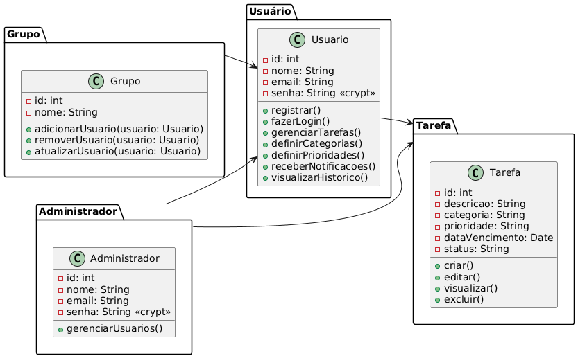
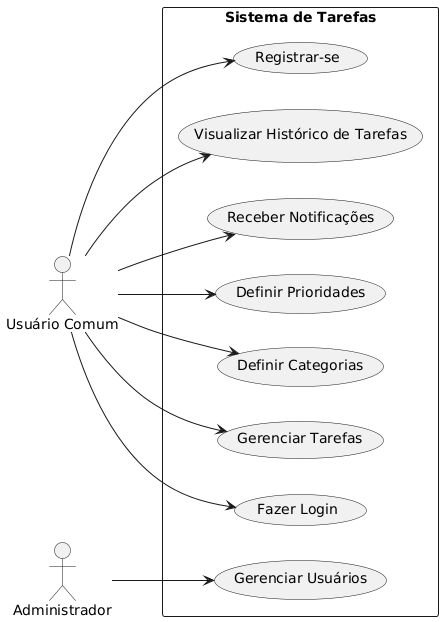
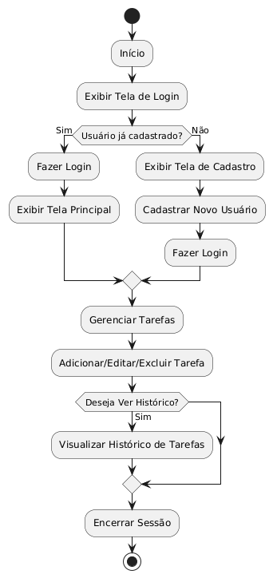

# Aplicação To-Do List para Escola SENAI

## 1. O que Vamos Fazer

Desenvolver uma aplicação web de To-Do List utilizando tecnologias modernas e práticas de mercado, garantindo segurança, escalabilidade e uma experiência de usuário fluida. Este projeto visa aplicar e aprimorar habilidades em React, Node.js, MongoDB e JWT, criando uma solução completa e funcional que pode ser implementada no mundo real.

## 2. Escopo Funcional

- **Cadastro de Usuários:** Permitir que os colaboradores se cadastrem com seus dados pessoais e criem uma conta segura.
- **Login e Autenticação:** Implementar um sistema de login seguro utilizando JWT para garantir que apenas usuários autorizados acessem a aplicação.
- **Gestão de Tarefas:** Permitir aos usuários criar, editar, visualizar e excluir tarefas.
- **Categorias e Prioridades:** Organizar as tarefas em categorias e permitir que os usuários definam prioridades.
- **Notificações:** Enviar lembretes para os usuários sobre as tarefas próximas de vencer.
- **Relatórios:** Gerar relatórios periódicos sobre o progresso das tarefas.
- **Histórico de Tarefas:** Manter um histórico de tarefas concluídas.
- **Interface Amigável:** Criar uma interface intuitiva e fácil de usar, acessível para todos os colaboradores.

## 3. Escopo Não Funcional

- **Desempenho:** A aplicação deve carregar rapidamente e ter um tempo de resposta adequado, mesmo com muitos usuários e tarefas cadastradas.
- **Segurança:** Implementar criptografia de dados e proteção contra ataques comuns, como SQL Injection e Cross-Site Scripting (XSS), utilizando práticas de segurança robustas com JWT.
- **Usabilidade:** A interface deve ser acessível a todos os tipos de usuários, com uma curva de aprendizado mínima.
- **Disponibilidade:** A aplicação deve estar disponível 99,9% do tempo, com downtime mínimo para manutenção.
- **Compatibilidade:** A aplicação deve ser compatível com os principais navegadores e dispositivos móveis.
- **Escalabilidade:** A arquitetura deve permitir a adição de novas funcionalidades e usuários sem perda de desempenho.

## 4. Objetivos SMART

- **Específico:** Desenvolver uma aplicação To-Do List que permita aos colaboradores do SENAI gerenciar suas tarefas.
- **Mensurável:** Atingir 100% das funcionalidades descritas no escopo funcional até a data de entrega.
- **Alcançável:** Utilizar tecnologias adequadas, como React, Node.js, MongoDB e JWT, e uma equipe qualificada para desenvolver a aplicação.
- **Relevante:** A aplicação deve melhorar a organização e eficiência dos colaboradores do SENAI.
- **Temporal:** Completar o desenvolvimento e entrega da aplicação em 6 meses.

## 5. Cronograma

- **Mês 1:** Planejamento e definição de requisitos
- **Mês 2:** Design da interface e arquitetura do sistema
- **Mês 3-4:** Desenvolvimento das funcionalidades principais
- **Mês 5:** Testes e correções
- **Mês 6:** Implantação e treinamento dos usuários

## 6. Análise de Risco

- **Atrasos no Cronograma:** Mitigar com acompanhamento semanal e ajustes no cronograma quando necessário.
- **Problemas de Segurança:** Mitigar com testes de segurança durante o desenvolvimento e revisões periódicas.
- **Resistência dos Usuários:** Mitigar com treinamento adequado e uma interface intuitiva.

## 7. Recursos

- **Humanos:** Desenvolvedores, Designers, Gerente de Projeto, Testadores.
- **Tecnológicos:** Servidores para hospedagem, Ferramentas de Desenvolvimento (IDE, Gerenciadores de Banco de Dados), Ferramentas de Gestão de Projetos.
- **Financeiros:** Orçamento para pagamento da equipe, aquisição de licenças e manutenção da aplicação.
- **Tempo:** 6 meses para o desenvolvimento completo do projeto.

## 8. Diagramas

### Diagrama de Classes

### Diagrama de Casos de Uso

### Diagrama de Fluxo

